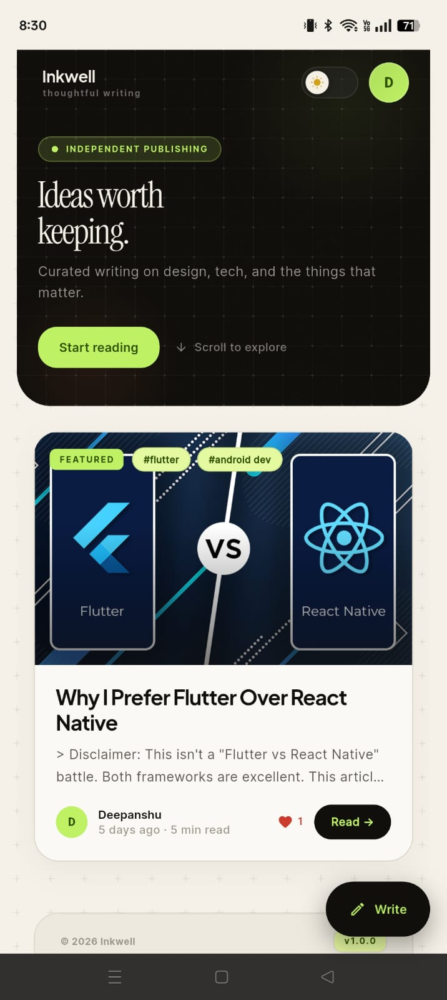
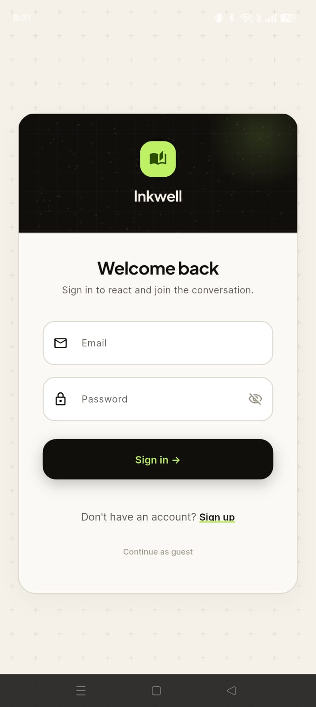
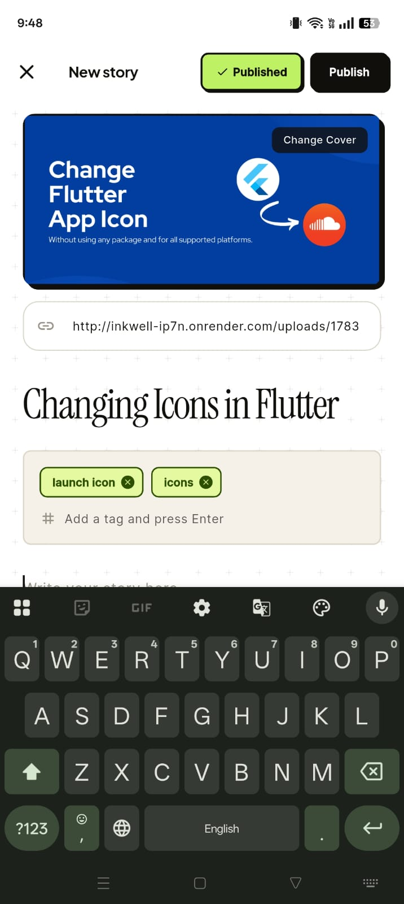
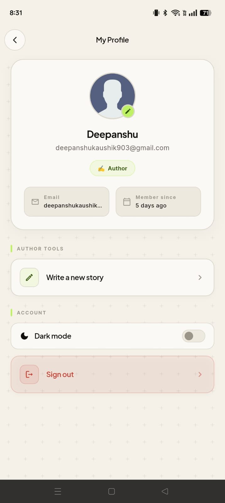
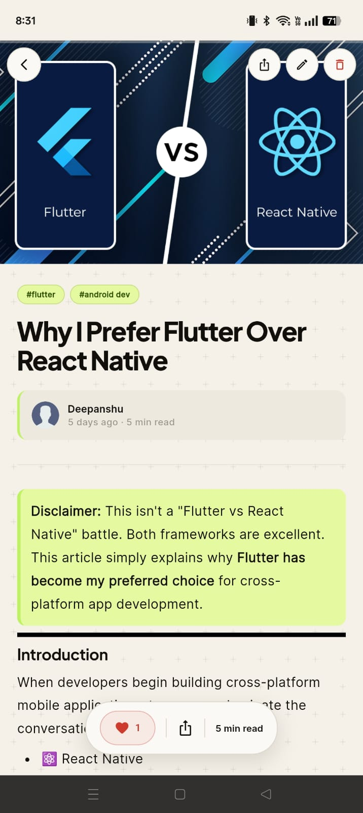
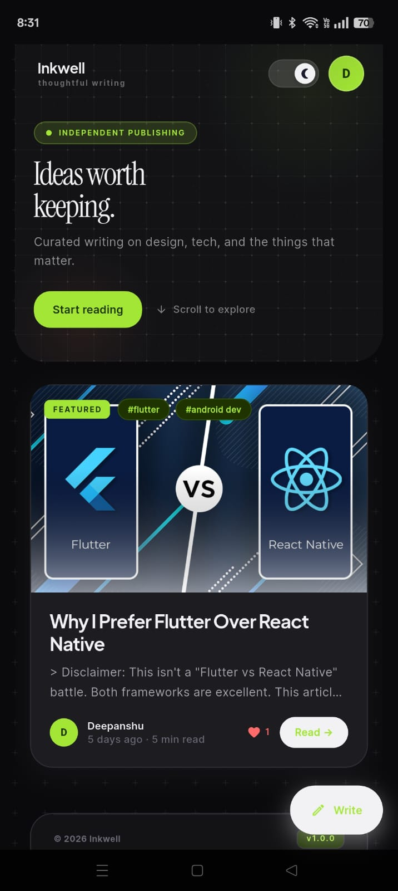

<div align="center">

# 🖋️ Inkwell — Thoughtful Writing

**A full-stack mobile blogging app for reading, writing, and reacting to thoughtfully curated stories.**

Built with **Flutter** on the front end and **Node.js (Express + MongoDB)** on the back end.

[](https://flutter.dev)
[](https://nodejs.org)
[](https://www.mongodb.com)
[](#-license)

[📲 Download APK](../../releases/latest) · [🚀 Features](#-features) · [🛠 Setup](#️-getting-started) · [📁 Structure](#-folder-structure)

</div>

---

## 📲 Download

Grab the latest signed build straight from the **Releases** page — no build setup required:

<div align="center">

### [⬇️ Download Inkwell APK (Latest Release)](../../releases/latest)

</div>

> Go to the **[Releases](../../releases)** tab of this repo and grab the `.apk` file from the **Assets** section of the newest release. Enable *"Install from unknown sources"* on your Android device if prompted.

---

## 📸 Screenshots

<div align="center">

| Home | Sign In | Article Editor |
|:---:|:---:|:---:|
|  |  |  |

| Profile | Light Mode | Dark Mode |
|:---:|:---:|:---:|
|  |  |  |

</div>


---

## 🚀 Features

| | |
|---|---|
| ✍️ **Read & Write** | Browse curated articles and write your own using a full Markdown editor |
| 🌗 **Dynamic Theming** | Polished built-in Light and Dark modes |
| 🔐 **Authentication** | Secure sign-up / sign-in with JWT-based sessions |
| 🎬 **Interactive UI** | Smooth transitions, shimmer loading states, and micro-animations |
| ❤️ **Reactions** | Like articles and see engagement in real time |
| 📊 **Profile Dashboard** | Track your stats, liked articles, and author tools (if permitted) |

---

## 🧱 Tech Stack

- **Frontend:** Flutter (Dart)
- **Backend:** Node.js, Express
- **Database:** MongoDB
- **Auth:** JWT

---

## 📁 Folder Structure

```
Inkwell/
├── frontend/     # Flutter application
│   └── Screens/  # UI screenshots used in this README
├── backend/      # Node.js (Express + MongoDB) REST API
└── README.md
```

---

## 🛠️ Getting Started

### Prerequisites

- [Node.js](https://nodejs.org) (LTS) and npm
- [Flutter SDK](https://docs.flutter.dev/get-started/install)
- A running MongoDB instance (local or [Atlas](https://www.mongodb.com/atlas))

### 1. Clone the repository

```bash
git clone https://github.com/Deepanshu-ui-dev/Inkwell.git
cd Inkwell
```

### 2. Backend Setup (Node.js)

```bash
cd backend
npm install
cp .env.example .env   # then fill in your MongoDB URI, JWT secret, etc.
npm run dev            # or: node index.js
```

The backend runs on `http://localhost:8000` by default.

### 3. Frontend Setup (Flutter)

```bash
cd frontend
flutter pub get
cp .env.example .env    # then set API_BASE_URL
flutter run
```

**`API_BASE_URL` values:**

| Environment | URL |
|---|---|
| Desktop (Linux/macOS/Windows) | `http://127.0.0.1:8000/api` |
| Android Emulator | `http://10.0.2.2:8000/api` |
| Physical Device | `http://<your-computer-local-IP>:8000/api` |

---

## 🔒 Security Notes

- `frontend/.env` and `backend/.env` are git-ignored and will never be pushed — always copy from the matching `.env.example` file.
- Never commit real API keys, database URIs, or JWT secrets.

---

## 🤝 Contributing

Contributions, issues, and feature requests are welcome!
Feel free to check the [issues page](../../issues) or open a pull request.

## 📄 License

This project is licensed under the MIT License — see the [LICENSE](LICENSE) file for details.

## 👤 Author

**Deepanshu** — [@Deepanshu-ui-dev](https://github.com/Deepanshu-ui-dev)

---

<div align="center">

If you like this project, consider giving it a ⭐ on GitHub!

</div>
